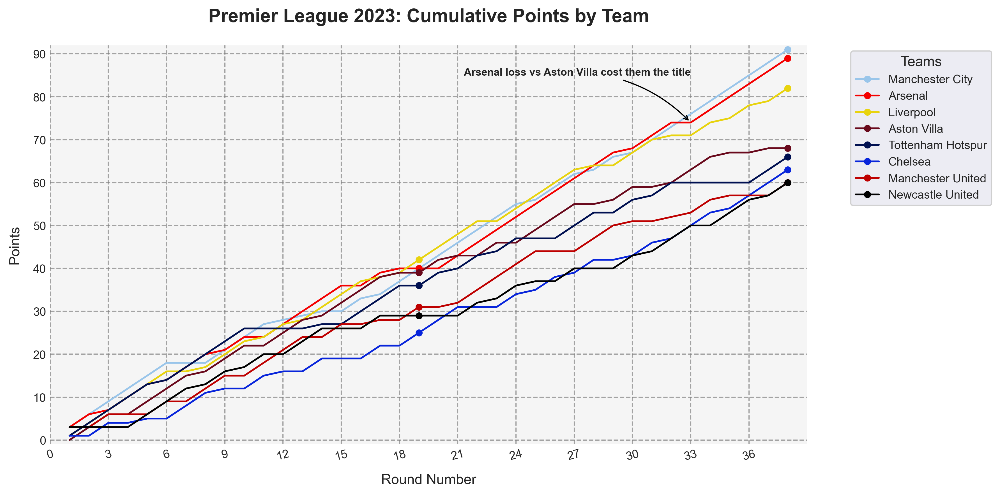

# Premier League Performance Analysis



A technical demonstration of data analysis capabilities using Python's core scientific stack. Processes raw match data to calculate team performance metrics and generates professional visualizations.

## Key Technical Components

### Data Processing
- **Pandas** for CSV ingestion and complex transformations
- Lambda functions for point calculations
- Multi-index grouping and cumulative summation
- Data reshaping with pivot tables

### Visualization
- **Matplotlib** for publication-quality charts
- Custom grid styling and annotations
- Team-specific color encoding
- Dynamic legend positioning

### Analysis
- 3-point system implementation
- Top-8 team filtering
- Round-by-round trend analysis

## Requirements
```bash
pip install pandas matplotlib numpy
```

## Execution
1. Run analysis:
```bash
python main.py
```

## CSV Structure
```csv
round_number,home_team_name,away_team_name,home_team_goals,away_team_goals
```

## Technical Showcase
- **Pandas**: `groupby`, `apply`, `pivot`, `concat`
- **Matplotlib**: Grid customization, annotation placement, style contexts
- **NumPy**: Underlying array operations for efficient computation
- **Python**: Object-oriented plotting architecture

## Output
- `cumulative_points.png`: Annotated line chart tracking top teams

---

**Note**: This is a portfolio piece demonstrating technical implementation skills rather than a reusable analysis framework. The code emphasizes clean pandas workflows and matplotlib best practices.